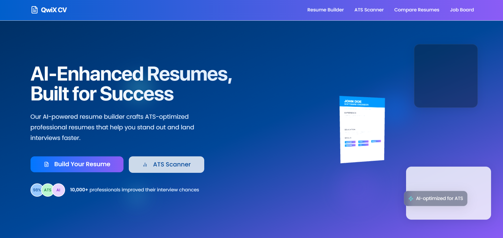
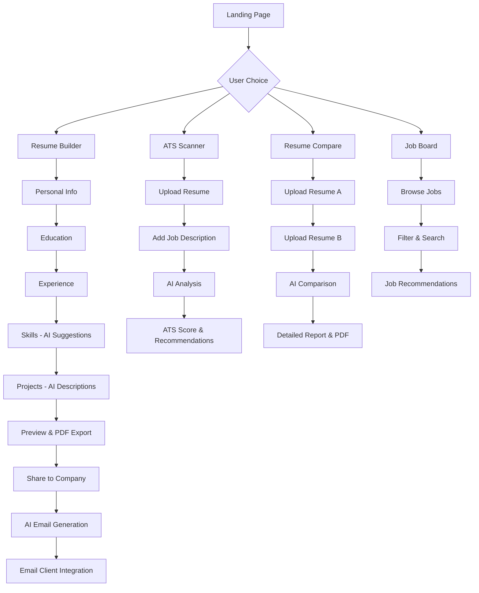

# QWIK CV - AI-Powered Resume Builder

<div align="center">
  <h3>Build ATS-optimized resumes with AI assistance</h3>
</div>



## 🚀 Project Overview

QWIK CV is an advanced resume builder that leverages artificial intelligence to help job seekers create professional, ATS-optimized resumes tailored to specific job descriptions. The platform offers intelligent content suggestions, real-time ATS scoring, resume comparison tools, and automated job matching to streamline the job application process.

## ✨ Key Features

- **AI-Powered Resume Generation**: Create professional resumes with AI-generated content suggestions
- **ATS Optimization**: Real-time ATS compatibility scoring against job descriptions
- **Resume Comparison**: Compare your resume against job descriptions with visual feedback
- **Template Selection**: Choose from multiple professionally designed resume templates
- **Job Matching**: Get personalized job recommendations based on your resume content
- **PDF Export**: Download your resume as a professionally formatted PDF document
- **Job Search**: Browse job listings that match your skills and experience
- **Share to Companies**: Email your resume directly to potential employers

## 📊 Website Flow Chart



## 📁 File Structure

```
qwik-cv/
├── public/                          # Static assets
│   ├── og-image.png                # Open Graph image
│   └── favicon.ico                 # Site favicon
│
├── src/
│   ├── components/                 # Reusable UI components
│   │   ├── home/                   # Landing page components
│   │   │   ├── HeroSection.tsx     # Hero banner with CTA
│   │   │   ├── FeaturesSection.tsx # Features showcase
│   │   │   ├── HowItWorksSection.tsx # Process explanation
│   │   │   ├── TestimonialsSection.tsx # User testimonials
│   │   │   └── CtaSection.tsx      # Call-to-action section
│   │   │
│   │   ├── layout/                 # Layout components
│   │   │   └── MainLayout.tsx      # Main site layout with nav/footer
│   │   │
│   │   ├── resume/                 # Resume-specific components
│   │   │   ├── ATSScoreDisplay.tsx # ATS score visualization
│   │   │   ├── JobSuggestions.tsx  # Job recommendations
│   │   │   └── ResumeComparisonScanner.tsx # Resume comparison logic
│   │   │
│   │   └── ui/                     # shadcn/ui components
│   │       ├── button.tsx          # Button component
│   │       ├── input.tsx           # Input component
│   │       ├── card.tsx            # Card component
│   │       └── [50+ other UI components] # Complete UI library
│   │
│   ├── pages/                      # Route components
│   │   ├── Index.tsx               # Landing page
│   │   ├── ResumeBuilder.tsx       # Resume creation interface
│   │   ├── ResumePreview.tsx       # Resume preview & export
│   │   ├── ATSScanner.tsx          # ATS analysis tool
│   │   ├── ResumeCompare.tsx       # Resume comparison tool
│   │   ├── JobBoard.tsx            # Job search interface
│   │   ├── ShareToCompany.tsx      # Email sharing interface
│   │   ├── About.tsx               # About page
│   │   ├── Contact.tsx             # Contact page
│   │   └── NotFound.tsx            # 404 error page
│   │
│   ├── utils/                      # Utility functions
│   │   ├── geminiApi.ts            # Google Gemini AI integration
│   │   ├── atsScoreApi.ts          # ATS scoring logic
│   │   ├── comparisonReportApi.ts  # Resume comparison logic
│   │   ├── jobBoardApi.ts          # Job search functionality
│   │
│   ├── types/                      # TypeScript type definitions
│   │   ├── job.ts                  # Job-related types
│   │
│   ├── data/                       # Static data
│   │   └── recommendedJobs.ts      # Sample job data
│   │
│   ├── context/                    # React contexts
│   │   └── ThemeContext.tsx        # Theme management
│   │
│   ├── hooks/                      # Custom React hooks
│   │   ├── use-mobile.tsx          # Mobile detection hook
│   │   └── use-toast.ts            # Toast notification hook
│   │
│   └── lib/                        # Library configurations
│       └── utils.ts                # Utility functions (cn, etc.)
│
├── configuration files
├── vite.config.ts                  # Vite configuration
├── tailwind.config.ts              # Tailwind CSS configuration
├── tsconfig.json                   # TypeScript configuration
└── package.json                    # Dependencies and scripts
```


## 🛠️ Technology Stack

### Frontend  
-  **React** – UI component library  
-  **TypeScript** – Type-safe JavaScript  
-  **Tailwind CSS** – Utility-first CSS  
-  **shadcn/ui** – UI components  
-  **Three.js** – 3D JavaScript library  
-  **html2pdf.js** – PDF generation  
-  **Recharts** – Data visualization  

### Backend Libraries  
-  **Tanstack Query** – State management  
-  **React Router** – Routing  
-  **React Hook Form** – Form handling  
-  **date-fns** – Date utilities  

### API Integrations  
-  **AI Integration** – AI-powered features  
-  **Indeed API** – Job search  
-  **ATS Scanner API** – Resume analysis  
-  **Gemini AI API** – AI suggestions  


## 📐 Architecture

The application follows a modern component-based architecture with:

- **Component-Based Structure**: Modular, reusable UI components
- **Custom Hooks**: Encapsulated logic for data fetching and state management
- **Context API**: Global state management for themes and user preferences
- **Responsive Design**: Mobile-first approach with Tailwind CSS
- **Type Safety**: Comprehensive TypeScript interfaces for all data models

## 🚀 Getting Started

### Prerequisites
- Node.js & npm installed - [Install with nvm](https://github.com/nvm-sh/nvm#installing-and-updating)

### Installation

```sh
# Clone the repository
git clone <YOUR_REPO_URL>

# Navigate to the project directory
cd qwik-cv

# Install dependencies
npm install

# Start the development server
npm run dev
```

## 📱 Features in Detail

### Resume Builder
- Multi-step form for personal information, education, experience, and skills
- Real-time preview of the resume as you build it
- AI-powered content suggestions for each section
- Save and edit functionality

### ATS Scanner
- Upload job descriptions to analyze resume compatibility
- Real-time scoring and feedback
- Keyword matching analysis
- Improvement suggestions

### Resume Comparison
- Side-by-side visual comparison of resume and job description
- Highlighted matching keywords
- 3D visualization of the matching process
- Detailed PDF report generation

### Job Board
- Search for jobs based on skills and location
- Filter by job type, experience level, and more
- Save interesting job postings
- Direct application links

## 👨‍💻 Development Team

- **Sai Praneeth Reddy Dhadi** - Full Stack Developer (1602-23-733-038)
- **Manideep Reddy Kasireddy** - Full Stack Developer (1602-23-733-022)
- **Pravalika Batchu** - UI/UX Designer (1602-23-733-308)


## 📄 License

This project is licensed under the MIT License - see the LICENSE file for details.

## 🙏 Acknowledgements

- Icon library provided by [Lucide Icons](https://lucide.dev/)
- UI components from [shadcn/ui](https://ui.shadcn.com/)
- 3D visualizations powered by [Three.js](https://threejs.org/)
